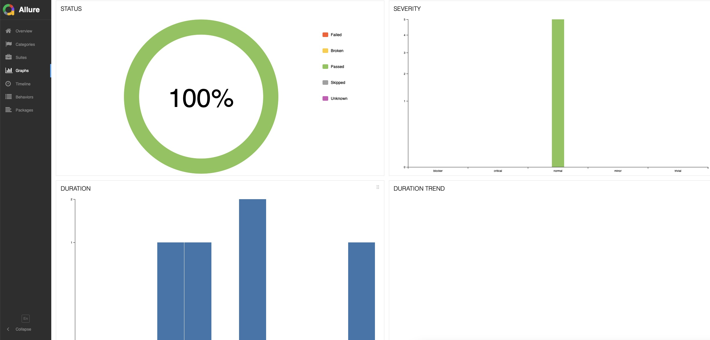

# 🚀 Cucumber RestAssured Demo


This project demonstrates how to automate API tests using **Cucumber** and **RestAssured**. It includes integration with **Allure** for reporting and **Docker** for containerized execution.

---

## 📋 Table of Contents

- [Introduction](#-introduction)
- [Features](#-features)
- [Getting Started](#-getting-started)
  - [Prerequisites](#prerequisites)
  - [Installation](#installation)
  - [Running the Tests](#running-the-tests)
- [Project Structure](#-project-structure)
- [Reporting](#-reporting)
- [Docker Support](#-docker-support)
- [Contributing](#-contributing)
- [License](#-license)

---

## 🌟 Introduction

This project is a **Cucumber** and **RestAssured**-based API testing framework. It allows you to write and execute automated API tests in a structured and maintainable way. The project also integrates with **Allure** for generating detailed test reports and **Docker** for running tests in a containerized environment.

---

## 🎯 Features

- **Automated API Testing**: Write and execute API tests using Cucumber and RestAssured.
- **Allure Reporting**: Generate detailed and interactive test reports.
- **Docker Support**: Run tests in a containerized environment for consistency.
- **Gradle Build**: Easy dependency management and build automation.

---

## 🚀 Getting Started

### Prerequisites

- Java JDK 17
- Gradle
- Docker (optional)

### Installation

1. Clone the repository:
   ```bash
   git clone https://github.com/satishgonella2024/cucumber-restassured-demo.git
   ```
2. Navigate to the project directory:
   ```bash
   cd cucumber-restassured-demo
   ```

### Running the Tests

- **Run tests locally**:
  ```bash
  ./gradlew clean test
  ```
- **Generate Allure report**:
  ```bash
  allure serve build/allure-results
  ```
- **Run tests in Docker**:
  ```bash
  docker build -t cucumber-restassured-demo .
  docker run cucumber-restassured-demo
  ```

---

## 📂 Project Structure

```
.
├── src
│   ├── test
│   │   ├── java
│   │   │   ├── runners
│   │   │   │   └── ApiTestRunner.java
│   │   │   └── stepdefinitions
│   │   │       └── ApiSteps.java
│   │   └── resources
│   │       ├── features
│   │       │   └── api_test.feature
│   │       └── allure.properties
├── build.gradle
├── Dockerfile
└── README.md
```

---

## 📊 Reporting

The project uses **Allure** for generating detailed test reports. After running the tests, you can view the report using:

```bash
allure serve build/allure-results
```

**Example Report**:


---

## 🐳 Docker Support

You can run the tests in a Docker container for consistency across environments.

1. **Build the Docker image**:
   ```bash
   docker build -t cucumber-restassured-demo .
   ```
2. **Run the Docker container**:
   ```bash
   docker run cucumber-restassured-demo
   ```

---

## 🤝 Contributing

Contributions are welcome! Please follow these steps:

1. Fork the repository.
2. Create a new branch.
3. Make your changes.
4. Submit a pull request.

---

## 📜 License

This project is licensed under the **MIT License**. See the [LICENSE](LICENSE) file for details.

---
